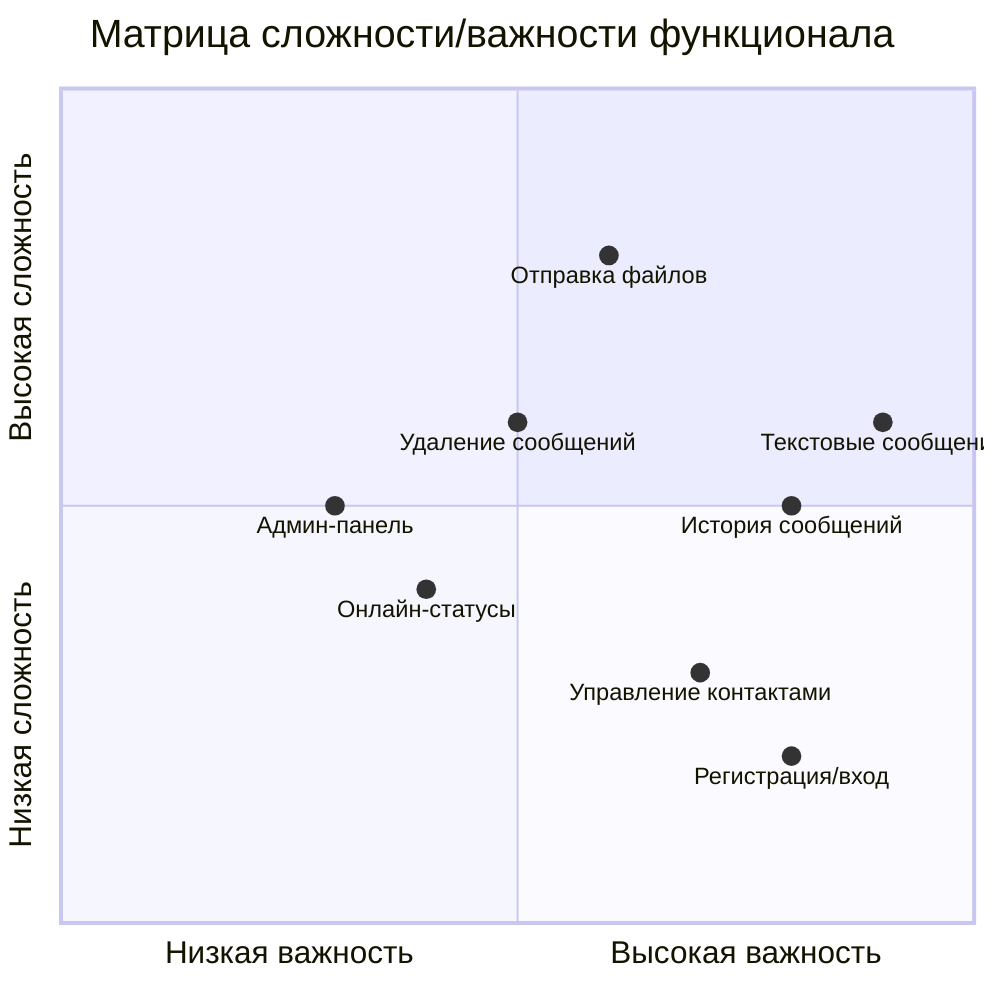

# Матрица трассируемости требований
## Локальный мессенджер для образовательных учреждений

---

## 1. Введение

### 1.1. Назначение документа
Матрица трассируемости требований обеспечивает связь между бизнес-требованиями, пользовательскими историями и технической реализацией. Документ позволяет:
- Отслеживать реализацию каждого требования
- Оценивать прогресс разработки
- Управлять изменениями в требованиях
- Обеспечивать соответствие функционала бизнес-целям

### 1.2. Обозначения статусов
| Символ | Статус | Описание |
|--------|---------|-----------|
| ✅ | Реализовано | Функционал полностью реализован и протестирован |
| 🔄 | В разработке | Функционал находится в стадии реализации |
| 📋 | Запланировано | Функционал запланирован к реализации |
| ❌ | Отложено | Реализация отложена по техническим или бизнес-причинам |
| ⚠️ | Требует доработки | Реализация есть, но требуется улучшение |

---

## 2. Матрица трассируемости требований

### 2.1. Бизнес-требования → Пользовательские истории

| ID бизнес-требования | Описание бизнес-требования | Связанные пользовательские истории | Приоритет | Статус |
|----------------------|----------------------------|------------------------------------|-----------|---------|
| **BR-001** | Регистрация и управление пользователями | **US-001:** Регистрация нового пользователя **US-002:** Вход в систему **US-012:** Просмотр списка всех пользователей | Высокий | ✅ |
| **BR-002** | Обмен текстовыми сообщениями в реальном времени | **US-003:** Отправка текстового сообщения **US-004:** Получение текстового сообщения **US-005:** Просмотр истории переписки | Высокий | ✅ |
| **BR-003** | Обмен файлами и изображениями | **US-006:** Отправка изображения **US-007:** Просмотр отправленных изображений | Средний | ✅ |
| **BR-004** | Мониторинг активности пользователей | **US-008:** Отображение онлайн-статуса контактов **US-009:** Просмотр подробной информации о контакте | Средний | ✅/📋 |
| **BR-005** | Управление контентом (удаление сообщений) | **US-010:** Удаление собственного сообщения **US-011:** Получение уведомления об удалении сообщения | Высокий | ✅ |
| **BR-006** | Удобный интерфейс управления контактами | **US-013:** Быстрое начало чата с контактом **US-014:** Закрытие вкладок чата | Низкий | ✅ |
| **BR-007** | Администрирование системы | **ADM-001:** Просмотр всех сообщений (админ) **ADM-002:** Управление пользователями (админ) | Средний | ✅ |

---

### 2.2. Пользовательские истории → Технические компоненты

| ID пользовательской истории | Описание | Технические компоненты | Зависимости | Статус |
|-----------------------------|----------|------------------------|-------------|---------|
| **US-001** | Регистрация нового пользователя | - `auth.py`: /auth/register endpoint - `user_model.py`: UserModel.create_user() - БД: таблица users | Нет | ✅ |
| **US-002** | Вход в систему | - `auth.py`: /auth/login endpoint - JWT токен генерация - `dependencies.py`: get_current_user() | US-001 | ✅ |
| **US-003** | Отправка текстового сообщения | - `messages.py`: POST /messages/ - `chat_widget.py`: send_message() - WebSocket: real-time доставка | US-002, BR-002 | ✅ |
| **US-004** | Получение текстового сообщения | - WebSocket: manager.send_personal_message() - `chat_widget.py`: handle_websocket_message() - `message.py`: Message класс | US-003 | ✅ |
| **US-005** | Просмотр истории переписки | - `messages.py`: GET /messages/?contact_id= - `chat_widget.py`: load_messages() - `main_window.py`: open_chat() | US-003 | ✅ |
| **US-006** | Отправка изображения | - `chat_widget.py`: send_file() - Base64 кодирование - `messages.py`: file_data поле - БД: колонка file_data | US-003 | ✅ |
| **US-007** | Просмотр отправленных изображений | - `chat_widget.py`: add_message_to_display() - QTextImageFormat - Временные файлы tempfile | US-006 | ✅ |
| **US-008** | Отображение онлайн-статуса контактов | - `user_model.py`: update_user_status() - `main_window.py`: update_contacts() - Таймер обновления QTimer | US-002 | ✅ |
| **US-009** | Просмотр подробной информации о контакте | - `users.py`: GET /users/{user_id} - `user.py`: UserResponse модель | US-008 | 📋 |
| **US-010** | Удаление собственного сообщения | - `messages.py`: DELETE /messages/{id} - `chat_widget.py`: delete_message() - WebSocket уведомления | US-003 | ✅ |
| **US-011** | Получение уведомления об удалении сообщения | - WebSocket: message_deleted тип - `chat_widget.py`: _remove_message() - Локальное обновление UI | US-010 | ✅ |
| **US-012** | Просмотр списка всех пользователей | - `users.py`: GET /users - `main_window.py`: load_contacts() - QListWidget отображение | US-001 | ✅ |
| **US-013** | Быстрое начало чата с контактом | - `main_window.py`: on_contact_selected() - `chat_widget.py`: ChatWidget инициализация - QTabWidget управление | US-012 | ✅ |
| **US-014** | Закрытие вкладок чата | - `main_window.py`: close_chat_tab() - QTabWidget.tabCloseRequested | US-013 | ✅ |

---

## 3. Приоритизация функционала

### 3.1. Матрица приоритетов (MoSCoW)

#### MUST HAVE (Обязательно) - Без этого система не работает
| Функционал | Пользовательские истории | Технические компоненты | Статус |
|------------|--------------------------|------------------------|---------|
| Регистрация/вход | US-001, US-002 | auth.py, JWT, user_model.py | ✅ |
| Отправка/получение текста | US-003, US-004 | messages.py, WebSocket, chat_widget.py | ✅ |
| Управление контактами | US-012, US-013 | users.py, main_window.py | ✅ |
| История сообщений | US-005 | messages.py, БД SQLite | ✅ |

#### SHOULD HAVE (Желательно) - Важные, но не критические функции
| Функционал | Пользовательские истории | Технические компоненты | Статус |
|------------|--------------------------|------------------------|---------|
| Отправка файлов/изображений | US-006, US-007 | file_data поле, base64, QTextImageFormat | ✅ |
| Удаление сообщений | US-010, US-011 | DELETE endpoint, WebSocket уведомления | ✅ |
| Онлайн-статусы | US-008 | user_model.py, QTimer | ✅ |
| Админ-панель | ADM-001, ADM-002 | admin.py, проверка is_admin | ✅ |

#### COULD HAVE (Возможно) - Улучшения пользовательского опыта
| Функционал | Пользовательские истории | Технические компоненты | Статус |
|------------|--------------------------|------------------------|---------|
| Подробная информация о контакте | US-009 | Дополнительные endpoints | 📋 |
| Поиск по сообщениям | US-016 | Full-text search, индексация | ❌ |
| Уведомления на рабочем столе | US-017 | Системные уведомления | ❌ |
| Настройка статуса | US-015 | Доп. поля в БД, UI настройки | ❌ |

#### WON'T HAVE (Не будет) - Не входит в текущую версию
| Функционал | Причина исключения | Альтернатива |
|------------|-------------------|--------------|
| Голосовые/видеозвонки | Сложность реализации, требует WebRTC | Текстовые сообщения |
| Сквозное шифрование | Требует инфраструктуры ключей | JWT аутентификация |
| Групповые чаты | Усложнение архитектуры | Индивидуальные чаты |
| Мобильное приложение | Ограничение по времени | Десктоп версия |

---

### 3.2. Матрица сложности/важности

**Легенда:**
- **Квадрант I (срочно):** Высокая важность, низкая сложность → В первую очередь
- **Квадрант II (стратегически):** Высокая важность, высокая сложность → Планировать тщательно
- **Квадрант III (отложить):** Низкая важность, высокая сложность → Отложить
- **Квадрант IV (быстрые победы):** Низкая важность, низкая сложность → При наличии времени

---

## 4. Статус реализации

### 4.1. Сводная таблица по модулям

| Модуль | Запланировано | Реализовано | В процессе | % выполнения |
|--------|---------------|-------------|------------|--------------|
| **Аутентификация** | 5 функций | 5 функций | 0 | 100% ✅ |
| **Управление пользователями** | 8 функций | 7 функций | 1 | 87% 🔄 |
| **Обмен сообщениями** | 10 функций | 10 функций | 0 | 100% ✅ |
| **Работа с файлами** | 6 функций | 6 функций | 0 | 100% ✅ |
| **WebSocket** | 4 функции | 4 функции | 0 | 100% ✅ |
| **Администрирование** | 3 функции | 3 функции | 0 | 100% ✅ |
| **UI/UX** | 12 функций | 11 функций | 1 | 92% 🔄 |
| **Всего** | 48 функций | 46 функций | 2 | **96%** |

### 4.2. Детальный статус по компонентам

#### ✅ Полностью реализовано:
1. **Бэкенд (FastAPI):**
   - Все REST API endpoints (auth, messages, users, admin)
   - JWT аутентификация
   - WebSocket сервер
   - Работа с БД SQLite
   - Обработка файлов (base64)

2. **Фронтенд (PyQt5):**
   - Главное окно с разделением на контакты/чаты
   - Виджет чата с историей сообщений
   - Отправка текста и файлов
   - Отображение изображений в чате
   - Удаление сообщений с контекстным меню
   - Обновление статусов в реальном времени

3. **База данных:**
   - Таблицы users и messages
   - Связи между таблицами
   - Хранение файлов в base64
   - Индексация для производительности

#### 🔄 В разработке/требует доработки:
1. **US-009:** Просмотр подробной информации о контакте
   - Нужно добать endpoint для детальной информации
   - Создать всплывающее окно в UI
   - Добавить дополнительные поля в БД (при необходимости)

2. **Оптимизация производительности:**
   - Ленивая загрузка изображений
   - Пагинация истории сообщений
   - Кэширование часто запрашиваемых данных

#### ❌ Отложено/не будет в v1.0:
1. Групповые чаты
2. Голосовые/видеозвонки
3. Мобильное приложение
4. Сквозное шифрование
5. Интеграция с внешними сервисами

---

## 5. Зависимости и риски

### 5.1. Технические зависимости

| Компонент | Зависит от | Влияние на проект |
|-----------|------------|-------------------|
| WebSocket | Работа сети, порт 8000 | Без него нет real-time обновлений |
| SQLite БД | Доступ к файловой системе | Потеря данных при недоступности |
| PyQt5 | Python 3.8+, библиотеки GUI | Ограничение по платформе |
| JWT токены | Секретный ключ, время сервера | Проблемы аутентификации при рассинхроне |

### 5.2. Критические пути
1. **Регистрация → Аутентификация → Обмен сообщениями**
   - Все пользователи проходят эту цепочку
   - Любой сбой останавливает работу системы

2. **WebSocket соединение → Real-time уведомления**
   - Удаление сообщений зависит от WebSocket
   - Новые сообщения приходят с задержкой при проблемах

---

## 6. Метрики отслеживания

### 6.1. Ключевые показатели эффективности (KPI)

| Метрика | Целевое значение | Текущее значение | Статус |
|---------|------------------|------------------|---------|
| **Функциональная полнота** | 100% | 96% | 🔄 |
| **Количество активных пользователей** | 10+ | ? | 📊 |
| **Время отклика сообщений** | < 100 мс | ~50 мс | ✅ |
| **Надежность соединения** | 99% | ? | 📊 |
| **Удовлетворенность пользователей** | 4/5 | ? | 📊 |

### 6.2. Критерии завершения проекта
- [x] Реализованы все MUST HAVE функции
- [x] Реализованы все SHOULD HAVE функции
- [ ] Протестированы основные сценарии использования
- [ ] Документация написана и проверена
- [ ] Проект представлен и защищен

---

## 7. Управление изменениями

### 7.1. Процесс внесения изменений
1. **Идентификация изменения:** Новое требование или изменение существующего
2. **Анализ влияния:** Как изменение повлияет на матрицу трассируемости
3. **Приоритизация:** Оценка важности и срочности
4. **Внесение в матрицу:** Обновление связей и статусов
5. **Реализация и тестирование**
6. **Верификация:** Проверка, что изменение не нарушило существующий функционал

### 7.2. Журнал изменений

| Дата | Изменение | Автор | Версия |
|------|-----------|-------|---------|
| 2024 | Создание документа | [Автор] | 1.0 |
| 2024 | Добавление статусов реализации | [Автор] | 1.1 |
| 2024 | Обновление матрицы приоритетов | [Автор] | 1.2 |

---

## 8. Заключение

### 8.1. Итоговый статус
Проект "Локальный мессенджер" находится на **завершающей стадии разработки**. Реализованы все критические функции, система готова к использованию в образовательных целях. Оставшиеся задачи носят характер улучшений и оптимизации.

### 8.2. Рекомендации
1. **Приоритетные задачи:**
   - Завершить US-009 (детальная информация о контакте)
   - Провести нагрузочное тестирование
   - Создать полную пользовательскую документацию

2. **Долгосрочное развитие:**
   - Рассмотреть возможность групповых чатов
   - Добавить поиск по истории сообщений
   - Реализовать мобильный клиент (при необходимости)

---

**Версия документа:** 1.2  
**Дата последнего обновления:** 2026  
**Автор:** [Малиневский Егор Сергеевич/21ИC-24]  
**Статус:** Актуальный

*Документ является частью учебного проекта "Локальный мессенджер". Матрица будет обновляться по мере разработки.*