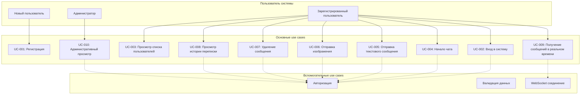
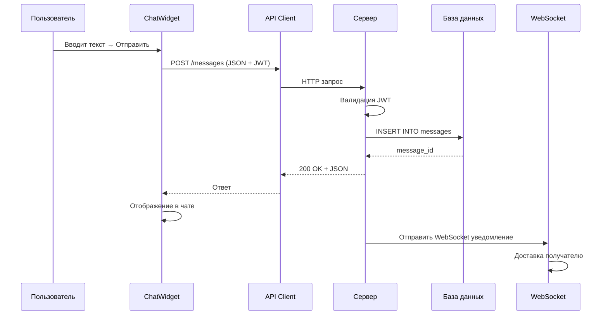

# Документ use case (Варианты использования)
## Локальный мессенджер для образовательных учреждений

**Версия документа:** 1.0 (фактическая)  
**Дата:** 2026  
**Автор:** Малиневский Егор Сергеевич/21ИС-24  
**Статус:** Учебный проект (реализован)

---

## 1. Диаграмма вариантов использования

---

## 2. Основные варианты использования

### UC-001: Регистрация нового пользователя
| Параметр | Значение |
|----------|----------|
| **ID** | UC-001 |
| **Название** | Регистрация нового пользователя |
| **Описание** | Создание новой учетной записи в системе мессенджера |
| **Основной актор** | Новый пользователь |
| **Второстепенные акторы** | Система аутентификации |
| **Предусловия** | Сервер доступен и работает |
| **Постусловия** | Учетная запись создана, пользователь может войти в систему |

**Основной поток событий:**
1. Пользователь запускает клиентское приложение
2. Система отображает окно входа
3. Пользователь вводит желаемое имя пользователя и пароль
4. Пользователь нажимает кнопку "Регистрация"
5. Система проверяет уникальность имени пользователя
6. Если имя уникально, система хеширует пароль (bcrypt)
7. Система создает запись пользователя в базе данных
8. Если это первый пользователь, система помечает его как администратора
9. Система отображает сообщение об успешной регистрации
10. Use case завершается

**Альтернативные потоки:**

*A1: Имя пользователя уже существует*
1. На шаге 5: Система обнаруживает, что имя пользователя уже занято
2. Система отображает сообщение об ошибке "Username already exists"
3. Пользователь может ввести другое имя пользователя
4. Возврат к шагу 3

*A2: Ошибка соединения с сервером*
1. На шаге 5: Не удается установить соединение с сервером
2. Система отображает сообщение "Cannot connect to server"
3. Use case завершается с ошибкой

---

### UC-002: Вход в систему
| Параметр | Значение |
|----------|----------|
| **ID** | UC-002 |
| **Название** | Вход в систему |
| **Описание** | Аутентификация зарегистрированного пользователя |
| **Основной актор** | Зарегистрированный пользователь |
| **Второстепенные акторы** | Система аутентификации, JWT сервис |
| **Предусловия** | Пользователь зарегистрирован в системе |
| **Постусловия** | Пользователь аутентифицирован, открыто главное окно |

**Основной поток событий:**
1. Пользователь запускает клиентское приложение
2. Система отображает окно входа
3. Пользователь вводит имя пользователя и пароль
4. Пользователь нажимает кнопку "Войти"
5. Система отправляет запрос на аутентификацию
6. Сервер проверяет учетные данные
7. Если учетные данные верны, сервер выдает JWT токен
8. Сервер обновляет статус пользователя на "онлайн"
9. Клиент сохраняет токен в памяти
10. Система отображает главное окно приложения
11. Система устанавливает WebSocket соединение для real-time уведомлений
12. Use case завершается успешно

**Альтернативные потоки:**

*A1: Неверные учетные данные*
1. На шаге 6: Сервер обнаруживает неверное имя пользователя или пароль
2. Сервер возвращает ошибку "Invalid credentials"
3. Система отображает сообщение об ошибке
4. Пользователь может повторить попытку входа
5. Возврат к шагу 3

*A2: Сервер недоступен*
1. На шаге 5: Не удается установить соединение с сервером
2. Система отображает сообщение "Cannot connect to server"
3. Use case завершается с ошибкой

---

### UC-003: Просмотр списка пользователей
| Параметр | Значение |
|----------|----------|
| **ID** | UC-003 |
| **Название** | Просмотр списка пользователей |
| **Описание** | Отображение всех пользователей системы с их статусами |
| **Основной актор** | Зарегистрированный пользователь |
| **Второстепенные акторы** | Сервер, таймер обновления |
| **Предусловия** | Пользователь аутентифицирован, открыто главное окно |
| **Постусловия** | Отображен актуальный список пользователей |

**Основной поток событий:**
1. Пользователь входит в систему (UC-002)
2. Система автоматически загружает список пользователей
3. Система отображает список в левой панели главного окна
4. Для каждого пользователя отображается:
   - Имя пользователя
   - Статус: 🟢 (онлайн) или ⚫ (оффлайн)
5. Таймер системы запускает периодическое обновление (каждые 10 секунд)
6. При обновлении система запрашивает актуальный список пользователей
7. Система обновляет статусы пользователей
8. Use case продолжается до закрытия приложения

**Альтернативные потоки:**

*A1: Ошибка при загрузке списка*
1. На шаге 2 или 6: Сервер недоступен или ошибка сети
2. Система сохраняет предыдущий список (если был загружен ранее)
3. В строке состояния отображается "Disconnected"
4. Таймер продолжает попытки переподключения

---

### UC-004: Начало чата с пользователем
| Параметр | Значение |
|----------|----------|
| **ID** | UC-004 |
| **Название** | Начало чата с пользователем |
| **Описание** | Открытие нового чата для общения с конкретным пользователем |
| **Основной актор** | Зарегистрированный пользователь |
| **Второстепенные акторы** | Сервер, система вкладок |
| **Предусловия** | Пользователь аутентифицирован, открыто главное окно |
| **Постусловия** | Открыта новая вкладка чата, загружена история сообщений |

**Основной поток событий:**
1. Пользователь просматривает список пользователей (UC-003)
2. Пользователь выбирает (кликает) на пользователя в списке
3. Система проверяет, не открыт ли уже чат с этим пользователем
4. Если чат не открыт:
   a. Система создает новую вкладку
   b. Система загружает историю переписки с выбранным пользователем
   c. Система отображает историю в области чата
   d. Фокус устанавливается на поле ввода сообщения
5. Если чат уже открыт:
   a. Система переключается на существующую вкладку
6. Use case завершается

**Альтернативные потоки:**

*A1: Пользователь выбирает себя в списке*
1. На шаге 2: Пользователь кликает на свое имя в списке
2. Система не создает чат (логически невозможно общаться с собой)
3. Use case завершается

---

### UC-005: Отправка текстового сообщения
| Параметр | Значение |
|----------|----------|
| **ID** | UC-005 |
| **Название** | Отправка текстового сообщения |
| **Описание** | Отправка текстового сообщения в активный чат |
| **Основной актор** | Зарегистрированный пользователь |
| **Второстепенные акторы** | Сервер, WebSocket система |
| **Предусловия** | Пользователь аутентифицирован, открыт чат с контактом |
| **Постусловия** | Сообщение отправлено, отображено в чате, получатель уведомлен |

**Основной поток событий:**
1. Пользователь открывает чат с контактом (UC-004)
2. Пользователь вводит текст сообщения в поле ввода
3. Пользователь нажимает кнопку "Отправить" или клавишу Enter
4. Система проверяет, что текст не пустой
5. Система отправляет сообщение на сервер через REST API
6. Сервер сохраняет сообщение в базе данных
7. Сервер отправляет WebSocket уведомление получателю
8. Система отображает отправленное сообщение в чате:
   - Позиция: правая сторона
   - Цвет фона: синий
   - Подпись: "Вы" и время отправки
   - ID сообщения под текстом
9. Очищается поле ввода сообщения
10. Use case завершается

**Альтернативные потоки:**

*A1: Пустое сообщение*
1. На шаге 4: Сообщение пустое или содержит только пробелы
2. Система игнорирует отправку
3. Use case завершается

*A2: Ошибка отправки*
1. На шаге 5: Ошибка сети или сервер недоступен
2. Система отображает сообщение об ошибке
3. Сообщение не отправляется, сохраняется в поле ввода
4. Пользователь может повторить попытку

---

### UC-006: Отправка изображения
| Параметр | Значение |
|----------|----------|
| **ID** | UC-006 |
| **Название** | Отправка изображения |
| **Описание** | Отправка изображения в активный чат |
| **Основной актор** | Зарегистрированный пользователь |
| **Второстепенные акторы** | Сервер, файловая система, WebSocket система |
| **Предусловия** | Пользователь аутентифицирован, открыт чат с контактом |
| **Постусловия** | Изображение отправлено, отображено в чате, получатель уведомлен |

**Основной поток событий:**
1. Пользователь открывает чат с контактом (UC-004)
2. Пользователь нажимает кнопку 📎 (прикрепить файл)
3. Система открывает диалоговое окно выбора файла
4. Пользователь выбирает файл изображения (PNG, JPG, JPEG, GIF, BMP)
5. Пользователь подтверждает выбор
6. Система кодирует изображение в base64
7. Система отправляет сообщение типа "image" на сервер
8. Сервер сохраняет сообщение с данными изображения в БД
9. Сервер отправляет WebSocket уведомление получателю
10. Система отображает изображение в чате:
    - Ширина: 200 пикселей
    - Позиция: правая сторона
    - Подпись: "Вы" и время отправки
    - ID сообщения под изображением
11. Создается временный файл для отображения изображения
12. Use case завершается

**Альтернативные потоки:**

*A1: Пользователь отменяет выбор файла*
1. На шаге 5: Пользователь отменяет выбор файла
2. Система закрывает диалоговое окно
3. Use case завершается

*A2: Неподдерживаемый формат файла*
1. На шаге 4: Пользователь выбирает файл неподдерживаемого формата
2. Система отображает сообщение об ошибке
3. Возврат к шагу 3

*A3: Ошибка кодирования или отправки*
1. На шаге 6 или 7: Ошибка кодирования или отправки
2. Система отображает сообщение об ошибке "Failed to send file"
3. Use case завершается с ошибкой

---

### UC-007: Удаление сообщения
| Параметр | Значение |
|----------|----------|
| **ID** | UC-007 |
| **Название** | Удаление сообщения |
| **Описание** | Удаление собственного отправленного сообщения |
| **Основной актор** | Зарегистрированный пользователь (отправитель сообщения) |
| **Второстепенные акторы** | Сервер, WebSocket система, система уведомлений |
| **Предусловия** | Пользователь аутентифицирован, сообщение принадлежит пользователю |
| **Постусловия** | Сообщение удалено у всех участников чата |

**Основной поток событий:**
1. Пользователь просматривает историю чата
2. Пользователь нажимает правой кнопкой мыши на своем сообщении
3. Система отображает контекстное меню
4. Пользователь выбирает пункт "Delete Message"
5. Система отображает диалоговое окно с запросом ID сообщения
6. Пользователь вводит ID сообщения (отображается под сообщением)
7. Пользователь подтверждает удаление
8. Система отправляет DELETE запрос на сервер
9. Сервер проверяет права пользователя (только свои сообщения)
10. Сервер удаляет сообщение из базы данных
11. Сервер отправляет WebSocket уведомление всем участникам чата
12. Все клиенты удаляют сообщение из интерфейса
13. Use case завершается

**Альтернативные потоки:**

*A1: Пользователь пытается удалить чужое сообщение*
1. На шаге 9: Сервер обнаруживает, что сообщение принадлежит другому пользователю
2. Сервер возвращает ошибку 403 "Cannot delete other users messages"
3. Система отображает сообщение об ошибке
4. Use case завершается с ошибкой

*A2: Сообщение не найдено*
1. На шаге 9: Сервер не находит сообщение с указанным ID
2. Сервер возвращает ошибку 404 "Message not found"
3. Система отображает сообщение об ошибке
4. Use case завершается с ошибкой

---

### UC-008: Просмотр истории переписки
| Параметр | Значение |
|----------|----------|
| **ID** | UC-008 |
| **Название** | Просмотр истории переписки |
| **Описание** | Загрузка и просмотр истории сообщений с конкретным пользователем |
| **Основной актор** | Зарегистрированный пользователь |
| **Второстепенные акторы** | Сервер, база данных |
| **Предусловия** | Пользователь аутентифицирован, открыт чат с контактом |
| **Постусловия** | Загружена и отображена история переписки |

**Основной поток событий:**
1. Пользователь открывает чат с контактом (UC-004)
2. Система автоматически отправляет запрос истории сообщений
3. Сервер возвращает последние 100 сообщений из переписки
4. Система сортирует сообщения по времени (старые сверху)
5. Система отображает каждое сообщение с соответствующим форматированием:
   - Свои сообщения: синий фон, справа
   - Сообщения контакта: серый фон, слева
   - Отображается время и ID каждого сообщения
   - Для изображений отображается миниатюра 200px
6. Пользователь может прокручивать историю
7. Use case завершается

**Альтернативные потоки:**

*A1: История пуста*
1. На шаге 3: Сервер возвращает пустой список сообщений
2. Система отображает пустую область чата
3. Use case завершается

---

### UC-009: Получение сообщений в реальном времени
| Параметр | Значение |
|----------|----------|
| **ID** | UC-009 |
| **Название** | Получение сообщений в реальном времени |
| **Описание** | Получение уведомлений о новых сообщениях и событиях через WebSocket |
| **Основной актор** | Система (автоматический процесс) |
| **Второстепенные акторы** | WebSocket клиент, пользовательский интерфейс |
| **Предусловия** | Пользователь аутентифицирован, установлено WebSocket соединение |
| **Постусловия** | Сообщения отображаются в соответствующих чатах |

**Основной поток событий:**
1. При входе в систему (UC-002) устанавливается WebSocket соединение
2. Система слушает входящие WebSocket сообщения
3. При получении сообщения типа "new_message":
   a. Система проверяет, открыт ли чат с отправителем
   b. Если чат открыт, сообщение добавляется в историю
   c. Если чат не открыт, сообщение сохраняется как непрочитанное
4. При получении сообщения типа "message_deleted":
   a. Система находит сообщение по ID
   b. Система удаляет сообщение из интерфейса
   c. Область чата перерисовывается
5. Use case продолжается до закрытия соединения

**Альтернативные потоки:**

*A1: Разрыв WebSocket соединения*
1. WebSocket соединение разрывается
2. Клиент пытается переподключиться автоматически
3. После переподключения синхронизация продолжается

---

### UC-010: Административный просмотр
| Параметр | Значение |
|----------|----------|
| **ID** | UC-010 |
| **Название** | Административный просмотр |
| **Описание** | Просмотр всей информации системы (только для администраторов) |
| **Основной актор** | Администратор системы |
| **Второстепенные акторы** | Сервер, база данных |
| **Предусловия** | Пользователь аутентифицирован как администратор |
| **Постусловия** | Получена административная информация |

**Основной поток событий:**
1. Администратор отправляет GET запрос на `/admin/all-messages`
2. Сервер проверяет права администратора
3. Сервер возвращает все сообщения из базы данных
4. Администратор отправляет GET запрос на `/admin/all-users`
5. Сервер возвращает полную информацию обо всех пользователях
6. Use case завершается

**Альтернативные потоки:**

*A1: Недостаточно прав*
1. На шаге 2: Пользователь не является администратором
2. Сервер возвращает ошибку 403 "Admin access required"
3. Use case завершается с ошибкой

---

## 3. Матрица соответствия use cases и функциональности

| Use Case ID | Название | Файлы реализации | Статус |
|-------------|----------|------------------|--------|
| UC-001 | Регистрация | `login_dialog.py`, `auth.py` | ✅ Реализован |
| UC-002 | Вход в систему | `login_dialog.py`, `auth.py`, `dependencies.py` | ✅ Реализован |
| UC-003 | Просмотр списка пользователей | `main_window.py`, `users.py` | ✅ Реализован |
| UC-004 | Начало чата | `main_window.py`, `chat_widget.py` | ✅ Реализован |
| UC-005 | Отправка текстового сообщения | `chat_widget.py`, `messages.py` | ✅ Реализован |
| UC-006 | Отправка изображения | `chat_widget.py`, `messages.py` | ✅ Реализован |
| UC-007 | Удаление сообщения | `chat_widget.py`, `messages.py`, `websocket_manager.py` | ✅ Реализован |
| UC-008 | Просмотр истории переписки | `chat_widget.py`, `messages.py` | ✅ Реализован |
| UC-009 | Получение сообщений в реальном времени | `websocket_client.py`, `websocket_manager.py` | ✅ Реализован |
| UC-010 | Административный просмотр | `admin.py`, `user_model.py` | ✅ Реализован |

---

## 4. Акторы системы

### 4.1. Основные акторы

**Новый пользователь (New User)**
- **Описание:** Пользователь, не имеющий учетной записи в системе
- **Use cases:** UC-001 (Регистрация)

**Зарегистрированный пользователь (Registered User)**
- **Описание:** Пользователь с активной учетной записью
- **Use cases:** UC-002, UC-003, UC-004, UC-005, UC-006, UC-007, UC-008, UC-009

**Администратор (Administrator)**
- **Описание:** Пользователь с расширенными правами (первый зарегистрированный)
- **Use cases:** Все use cases обычного пользователя + UC-010

### 4.2. Второстепенные акторы (системные)

**Система аутентификации (Authentication System)**
- **Описание:** Компонент, отвечающий за проверку учетных данных
- **Use cases:** UC-001, UC-002

**Сервер базы данных (Database Server)**
- **Описание:** SQLite база данных для хранения пользователей и сообщений
- **Use cases:** Все use cases, связанные с хранением данных

**WebSocket система (WebSocket System)**
- **Описание:** Система для real-time уведомлений
- **Use cases:** UC-005, UC-006, UC-007, UC-009

**Сервер приложений (Application Server)**
- **Описание:** FastAPI сервер, обрабатывающий все запросы
- **Use cases:** Все use cases

---

## 5. Нефункциональные use cases

### UC-NF-001: Поддержание соединения
| Параметр | Значение |
|----------|----------|
| **ID** | UC-NF-001 |
| **Название** | Поддержание соединения |
| **Тип** | Нефункциональный |
| **Описание** | Система автоматически поддерживает активные соединения и восстанавливает их при разрыве |
| **Требования** | Таймеры обновления, автоматическое переподключение WebSocket, обработка сетевых ошибок |

### UC-NF-002: Защита данных
| Параметр | Значение |
|----------|----------|
| **ID** | UC-NF-002 |
| **Название** | Защита данных |
| **Тип** | Нефункциональный |
| **Описание** | Система обеспечивает безопасность пользовательских данных |
| **Требования** | Хеширование паролей (bcrypt), JWT токены, проверка прав доступа |

### UC-NF-003: Отказоустойчивость
| Параметр | Значение |
|----------|----------|
| **ID** | UC-NF-003 |
| **Название** | Отказоустойчивость |
| **Тип** | Нефункциональный |
| **Описание** | Система корректно обрабатывает сбои и ошибки |
| **Требования** | Обработка сетевых ошибок, graceful degradation, информативные сообщения об ошибках |

---

## 6. Ограничения use cases

### 6.1. Не реализованные use cases (за пределами проекта)
1. **Редактирование сообщений** — пользователь не может изменить отправленное сообщение
2. **Групповые чаты** — только индивидуальная переписка 1-на-1
3. **Поиск по сообщениям** — нет возможности искать в истории
4. **Восстановление пароля** — при потере пароля нужно создавать нового пользователя
5. **Аудио/видеозвонки** — только текстовые сообщения и изображения
6. **Мобильный доступ** — только десктоп-клиент на PyQt5

### 6.2. Особенности реализации
1. **Удаление сообщений** требует ручного ввода ID сообщения
2. **Онлайн статус** обновляется с задержкой (10 секунд)
3. **Изображения** передаются через base64, что увеличивает размер данных
4. **Административный доступ** только через API, нет web-интерфейса

---

## 7. Диаграмма последовательности (пример для UC-005)

---

**Версия документа:** 1.0 (фактическая)  
**Дата:** 2026  
**Статус:** Точно соответствует реализованному проекту

*Документ описывает фактические варианты использования системы "Локальный мессенджер". Все use cases проверены по коду и реально работают в системе.*