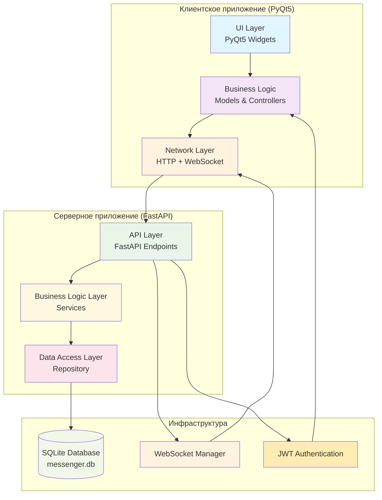
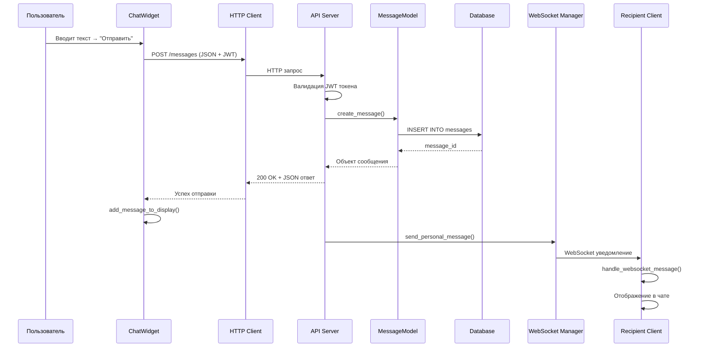
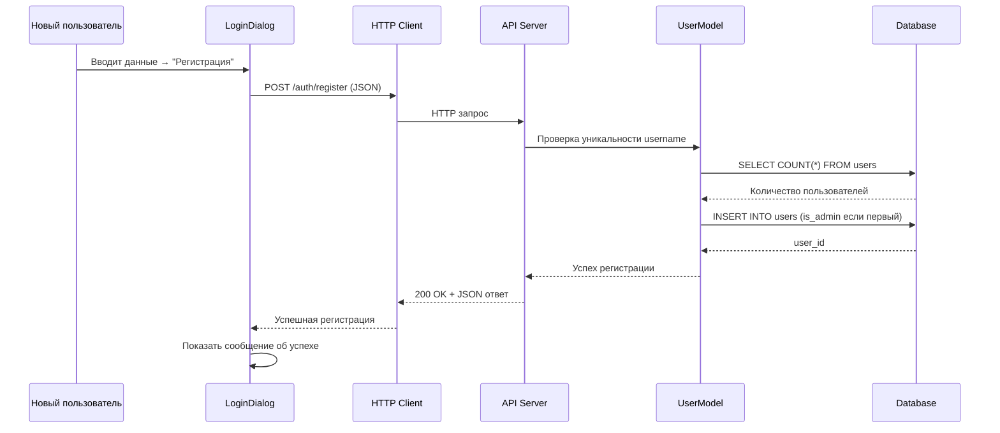
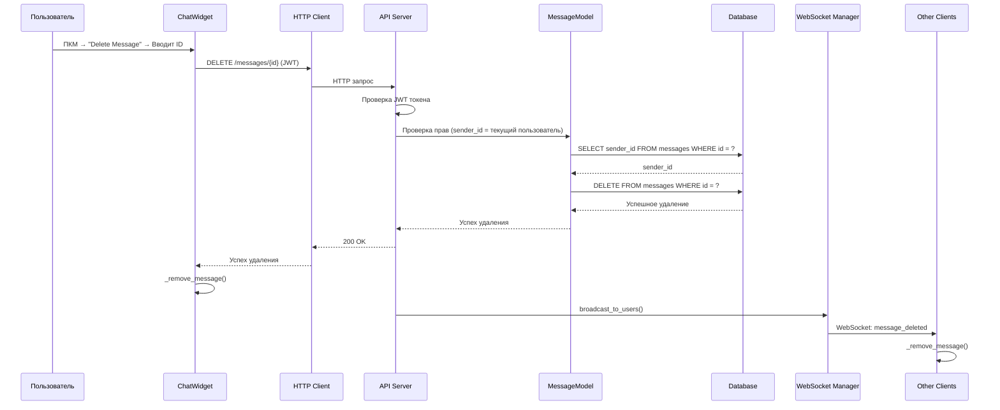
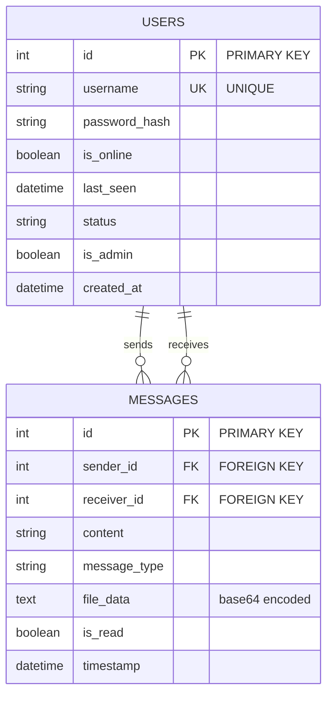

# Архитектурная документация
## Локальный мессенджер для образовательных учреждений

**Версия документа:** 1.0  
**Дата:** 2026  
**Автор:** Малиневский Егор Сергеевич/21ИС-24  
**Статус:** Учебный проект (реализован)

---

## 1. Общая архитектура системы

### 1.1. Высокоуровневая архитектура
```
┌─────────────────────────────────────────────────────────┐
│                 Образовательное учреждение                │
│                                                         │
│  ┌──────────────┐          Локальная сеть            ┌──────────────┐ │
│  │   Клиент 1   │◄──────────(TCP/IP)───────────────►│    Сервер    │ │
│  │  (PyQt5)     │                                   │   (FastAPI)  │ │
│  └──────────────┘                                   │  ┌─────────┐ │ │
│                                                     │  │ SQLite  │ │ │
│  ┌──────────────┐                                   │  │   БД    │ │ │
│  │   Клиент 2   │◄──────────HTTP/WebSocket─────────►│  └─────────┘ │ │
│  │  (PyQt5)     │                                   └──────────────┘ │
│  └──────────────┘                                                     │
│                                                                       │
│  ┌──────────────┐                                                     │
│  │   Клиент N   │◄───────────────────────────────────────────────────►│
│  │  (PyQt5)     │                                                     │
│  └──────────────┘                                                     │
└───────────────────────────────────────────────────────────────────────┘
```

### 1.2. Ключевые характеристики архитектуры
- **Клиент-серверная модель** с четким разделением ответственности
- **REST API** для синхронных операций (регистрация, вход, история)
- **WebSocket** для асинхронных уведомлений (новые сообщения, удаления)
- **Единая точка входа** (сервер на порту 8000)
- **Локальное хранение данных** (SQLite на сервере)

---

## 2. Диаграмма компонентов

### 2.1. Полная диаграмма компонентов


### 2.2. Описание компонентов

#### **Клиентская часть:**
| Компонент | Файл | Ответственность |
|-----------|------|-----------------|
| **UI Layer** | `main_window.py`, `chat_widget.py`, `login_dialog.py` | Графический интерфейс, обработка пользовательского ввода |
| **Business Logic** | `message.py`, `user.py` | Модели данных, бизнес-логика представления |
| **Network Layer** | `websocket_client.py`, `config.py` | Сетевое взаимодействие, конфигурация |

#### **Серверная часть:**
| Компонент | Файл | Ответственность |
|-----------|------|-----------------|
| **API Layer** | `main.py`, `auth.py`, `messages.py`, `users.py`, `admin.py` | REST endpoints, WebSocket endpoint |
| **Business Logic** | `user_model.py`, `message_model.py` | Бизнес-логика, валидация |
| **Data Access** | `db.py` | Работа с базой данных, CRUD операции |
| **Infrastructure** | `websocket_manager.py`, `dependencies.py` | WebSocket управление, JWT аутентификация |

---

## 3. Диаграммы последовательности

### 3.1. Отправка текстового сообщения


### 3.2. Регистрация пользователя


### 3.3. Удаление сообщения


---

## 4. Схема базы данных

### 4.1. ER-диаграмма базы данных


### 4.2. Детальное описание таблиц

#### Таблица `users`:
```sql
CREATE TABLE users (
    id INTEGER PRIMARY KEY AUTOINCREMENT,
    username TEXT UNIQUE NOT NULL,          -- Уникальное имя пользователя
    password_hash TEXT NOT NULL,            -- Хеш пароля (bcrypt)
    is_online BOOLEAN DEFAULT FALSE,        -- Онлайн статус
    last_seen DATETIME,                     -- Время последней активности
    status TEXT DEFAULT 'offline',          -- Текстовый статус
    is_admin BOOLEAN DEFAULT FALSE,         -- Флаг администратора
    created_at DATETIME DEFAULT CURRENT_TIMESTAMP  -- Дата регистрации
);
```

#### Таблица `messages`:
```sql
CREATE TABLE messages (
    id INTEGER PRIMARY KEY AUTOINCREMENT,
    sender_id INTEGER NOT NULL,             -- ID отправителя (FK → users.id)
    receiver_id INTEGER NOT NULL,           -- ID получателя (FK → users.id)
    content TEXT NOT NULL,                  -- Текст сообщения или описание файла
    message_type TEXT DEFAULT 'text',       -- Тип: 'text' или 'image'
    file_data TEXT,                         -- Данные файла в base64 (для изображений)
    is_read BOOLEAN DEFAULT FALSE,          -- Флаг прочтения
    timestamp DATETIME DEFAULT CURRENT_TIMESTAMP,  -- Время отправки
    FOREIGN KEY (sender_id) REFERENCES users (id),
    FOREIGN KEY (receiver_id) REFERENCES users (id)
);
```

### 4.3. Основные запросы и индексы

#### Часто используемые запросы:
```sql
-- 1. Получение диалога между двумя пользователями
SELECT * FROM messages 
WHERE (sender_id = ? AND receiver_id = ?) 
   OR (sender_id = ? AND receiver_id = ?)
ORDER BY timestamp DESC
LIMIT 100;

-- 2. Получение непрочитанных сообщений
SELECT * FROM messages 
WHERE receiver_id = ? AND is_read = FALSE;

-- 3. Обновление онлайн статуса
UPDATE users SET is_online = ?, last_seen = ? WHERE id = ?;

-- 4. Получение списка пользователей с онлайн статусом
SELECT id, username, is_online, status FROM users;
```

---

## 5. API архитектура

### 5.1. REST API структура
```
http://{server_ip}:8000
├── /auth
│   ├── POST /register      # Регистрация нового пользователя
│   ├── POST /login         # Вход в систему (получение JWT)
│   └── POST /logout        # Выход из системы
│
├── /users
│   ├── GET /               # Список всех пользователей
│   ├── GET /me             # Информация о текущем пользователе
│   └── GET /{user_id}      # Информация о конкретном пользователе
│
├── /messages
│   ├── GET /               # История переписки (с параметром contact_id)
│   ├── POST /              # Отправка сообщения
│   ├── DELETE /{message_id}# Удаление сообщения
│   ├── PUT /{message_id}/read  # Отметка как прочитанное
│   └── GET /unread         # Непрочитанные сообщения
│
├── /admin
│   ├── GET /all-messages   # Все сообщения (только для админов)
│   └── GET /all-users      # Все пользователи (только для админов)
│
└── /ws/{user_id}           # WebSocket endpoint для real-time уведомлений
```

### 5.2. WebSocket протокол
```
Endpoint: ws://{server_ip}:8000/ws/{user_id}

Типы сообщений:
1. new_message - новое сообщение
   {
     "type": "new_message",
     "message": { ... данные сообщения ... }
   }

2. message_deleted - удаление сообщения
   {
     "type": "message_deleted",
     "message_id": 123,
     "deleted_by": 1
   }

3. keep-alive - поддержание соединения
   Клиент → Сервер: "ping"
   Сервер → Клиент: "pong"
```

---

## 6. Архитектурные решения и обоснование

### 6.1. Выбор технологий

| Компонент | Технология | Обоснование выбора |
|-----------|------------|-------------------|
| **Бэкенд фреймворк** | FastAPI | Быстрый, современный, встроенная поддержка WebSocket, автоматическая документация |
| **База данных** | SQLite | Простота, не требует отдельного сервера БД, подходит для локального использования |
| **Клиентский фреймворк** | PyQt5 | Кроссплатформенность, богатые возможности GUI, интеграция с Python |
| **Аутентификация** | JWT | Stateless подход, не требует хранения сессий на сервере |
| **Real-time коммуникация** | WebSocket | Двусторонняя связь в реальном времени, низкие задержки |

### 6.2. Ключевые архитектурные решения

#### 1. **Монолитная серверная архитектура**
- **Решение:** Все серверные компоненты в одном приложении (FastAPI)
- **Обоснование:** Учебный проект, простота разработки и развертывания
- **Недостатки:** Ограниченная масштабируемость

#### 2. **SQLite как основное хранилище**
- **Решение:** Один файл БД на сервере
- **Обоснование:** Не требует установки отдельного сервера БД
- **Ограничения:** Проблемы с конкурентным доступом при высокой нагрузке

#### 3. **Base64 для передачи изображений**
- **Решение:** Кодирование изображений в base64 и хранение в БД
- **Обоснование:** Простота реализации, не требует отдельного файлового хранилища
- **Ограничения:** Увеличение размера данных, ограничение на размер файлов

#### 4. **Смешанный HTTP/WebSocket подход**
- **Решение:** REST API для CRUD операций + WebSocket для уведомлений
- **Обоснование:** Оптимальное сочетание для мессенджера
- **Преимущества:** Эффективное использование протоколов

### 6.3. Ограничения архитектуры

#### 1. **Масштабируемость:**
- ❌ SQLite не подходит для высоких нагрузок
- ❌ Один процесс сервера, нет балансировки нагрузки
- ❌ Нет кэширования, все запросы к БД

#### 2. **Надежность:**
- ⚠️ Одна точка отказа (один сервер)
- ⚠️ Нет репликации БД
- ⚠️ Нет автоматического бэкапа

#### 3. **Безопасность:**
- ✅ JWT аутентификация
- ✅ Хеширование паролей (bcrypt)
- ❌ Нет шифрования сообщений
- ❌ Нет защиты от DDoS

---

## 7. Диаграмма развертывания

### 7.1. Физическая архитектура развертывания
```
Образовательное учреждение
│
├── Компьютерный класс/Лаборатория
│   │
│   ├── Серверный компьютер
│   │   ├── Процесс: uvicorn main:app --host 0.0.0.0 --port 8000
│   │   ├── Файлы: messenger.db (БД), server.log (логи)
│   │   └── Сетевой интерфейс: Статический IP (например, 192.168.0.100)
│   │
│   └── Клиентские компьютеры (Windows/Linux)
│       ├── Процесс: python main.py (клиент)
│       ├── Файлы: config.py (конфигурация)
│       └── Сетевой интерфейс: DHCP или статические IP в той же подсети
│
└── Сетевая инфраструктура
    ├── Коммутатор/Маршрутизатор
    ├── Локальная сеть: 192.168.0.0/24
    └── Открытый порт: 8000/TCP (только в локальной сети)
```

### 7.2. Требования к развертыванию
```yaml
server_requirements:
  operating_system: "Windows 10/11 или Linux (Ubuntu 20.04+)"
  python_version: "3.8+"
  dependencies:
    - "fastapi==0.104.1"
    - "uvicorn[standard]==0.24.0"
    - "python-jose[cryptography]==3.3.0"
    - "passlib[bcrypt]==1.7.4"
    - "websockets==12.0"
  
  network_configuration:
    ip_address: "статический (рекомендуется)"
    port: "8000"
    firewall: "разрешить входящие на порт 8000"

client_requirements:
  operating_system: ["Windows 10", "Windows 11", "Ubuntu 20.04+"]
  python_version: "3.8+"
  dependencies:
    - "pyqt5"
    - "requests"
    - "websockets"
  
  configuration:
    config_file: "config.py"
    required_settings:
      server_host: "IP адрес сервера"
      server_port: "8000"
```

---

## 8. Взаимодействие компонентов

### 8.1. Поток данных при нормальной работе
```
1. Клиент запускается → Загружает config.py → Подключается к серверу
2. Пользователь входит → JWT токен сохраняется в памяти клиента
3. Загружается список контактов → Отображается в UI
4. Пользователь отправляет сообщение:
   Клиент → HTTP POST → Сервер → БД → WebSocket → Получатель
5. Пользователь получает сообщение:
   WebSocket → Клиент → Парсинг → Отображение в UI
6. Пользователь удаляет сообщение:
   Клиент → HTTP DELETE → Сервер → БД → WebSocket → Все участники
```

### 8.2. Обработка ошибок
```
1. Потеря соединения с сервером:
   Клиент → Попытка переподключения → Сообщение об ошибке в UI
   
2. Неверный JWT токен:
   Клиент → Перенаправление на окно входа
   
3. Ошибка базы данных:
   Сервер → Логирование ошибки → 500 HTTP ответ клиенту
   
4. WebSocket разрыв соединения:
   Клиент → Автоматическое переподключение
```

---

## 9. Заключение

### 9.1. Итоги архитектуры
**Локальный мессенджер** реализован по **клиент-серверной архитектуре** с использованием:

1. **FastAPI** как серверный фреймворк с поддержкой REST и WebSocket
2. **SQLite** как простое и надежное хранилище данных
3. **PyQt5** для кроссплатформенного графического интерфейса
4. **JWT** для stateless аутентификации
5. **Смешанный HTTP/WebSocket** подход для оптимальной коммуникации

### 9.2. Сильные стороны архитектуры:
1. ✅ **Простота развертывания** — один сервер, один файл БД
2. ✅ **Кроссплатформенность** — работает на Windows и Linux
3. ✅ **Real-time коммуникация** — WebSocket для мгновенных уведомлений
4. ✅ **Модульность** — четкое разделение ответственности между компонентами
5. ✅ **Безопасность** — JWT аутентификация, хеширование паролей

### 9.3. Ограничения и рекомендации для будущего развития:
1. ⚠️ **Заменить SQLite на PostgreSQL** для лучшей масштабируемости
2. ⚠️ **Добавить кэширование** (Redis) для часто запрашиваемых данных
3. ⚠️ **Реализовать файловое хранилище** вместо base64 в БД
4. ⚠️ **Добавить балансировщик нагрузки** для поддержки большего числа пользователей
5. ⚠️ **Внедрить контейнеризацию** (Docker) для упрощения развертывания

---

**Версия документа:** 1.0  
**Дата:** 2026  
**Статус:** Точно соответствует реализованной архитектуре

*Документ описывает фактическую архитектуру учебного проекта "Локальный мессенджер". Все диаграммы и описания соответствуют реализованному коду.*