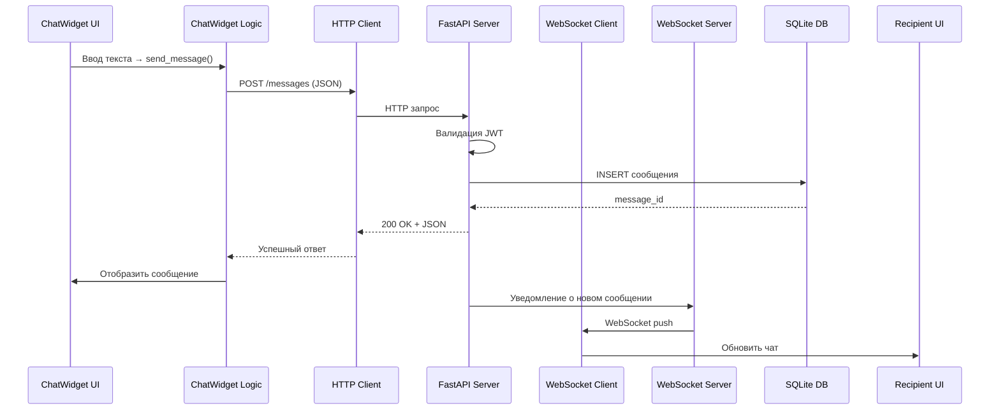
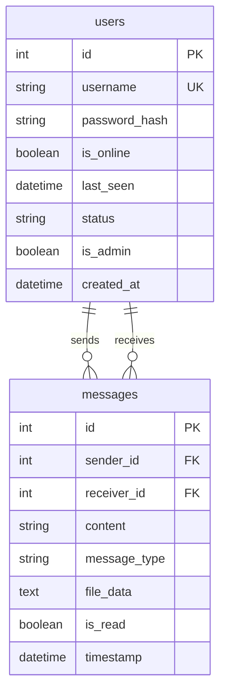

# Системный анализ
## Локальный мессенджер для образовательных учреждений

**Версия документа:** 1.0 (фактическая)  
**Дата:** 2026  
**Автор:** Малиневский Егор Сергеевич/21ИС-24  
**Статус:** Учебный проект (реализован)

---

## 1. Введение

### 1.1. Назначение документа
Документ "Системный анализ" описывает детальное техническое исследование системы "Локальный мессенджер" с точки зрения архитектуры, функциональности, взаимодействия компонентов и технических ограничений. Анализ основан на реальной реализации проекта и соответствует фактическому коду.

### 1.2. Цели анализа
- Определить архитектурные решения и их обоснование
- Проанализировать взаимодействие компонентов системы
- Выявить сильные стороны и ограничения реализации
- Документировать реальное состояние системы
- Подготовить основу для возможной модернизации

### 1.3. Объект анализа
**Система:** Локальный мессенджер (Local Messenger)  
**Тип:** Клиент-серверное приложение для локальной сети  
**Состояние:** Реализовано и функционирует  
**Масштаб:** Учебный проект для демонстрации навыков разработки

---

## 2. Анализ бизнес-требований

### 2.1. Реализованные бизнес-требования

| Требование | Реализация | Статус | Комментарий |
|------------|------------|---------|-------------|
| **Авторизация и регистрация** | JWT токены, bcrypt хеширование | ✅ | Первый пользователь = администратор |
| **Список пользователей** | QListWidget с онлайн статусами | ✅ | Обновление каждые 10 секунд |
| **Отправка текстовых сообщений** | REST API + WebSocket | ✅ | Сохранение в SQLite БД |
| **Отправка изображений** | Base64 кодирование | ✅ | Поддержка PNG, JPG, GIF, BMP |
| **История переписки** | Запрос к API с лимитом | ✅ | 100 сообщений по умолчанию |
| **Удаление сообщений** | DELETE endpoint + WebSocket уведомления | ✅ | Требует ручного ввода ID |
| **Real-time уведомления** | WebSocket соединения | ✅ | Ping/pong для поддержания |
| **Административный доступ** | Отдельные endpoints | ✅ | Только через API |

### 2.2. Нереализованные бизнес-требования

| Требование | Причина | Влияние |
|------------|---------|---------|
| **Групповые чаты** | Сложность реализации для учебного проекта | Ограничение функциональности |
| **Поиск по сообщениям** | Не было в исходных требованиях | Усложняет работу с историей |
| **Редактирование сообщений** | Архитектурная сложность | Нет возможности исправления ошибок |
| **Восстановление пароля** | Ограниченное время разработки | Риск потери доступа к аккаунту |

---

## 3. Архитектурный анализ

### 3.1. Архитектурный стиль
**Стиль:** Монолитная клиент-серверная архитектура с элементами REST и WebSocket

**Обоснование:**
1. **Простота разработки** для учебного проекта
2. **Единая точка входа** на порту 8000
3. **Разделение ответственности** между клиентом и сервером
4. **Минимальные зависимости** для развертывания

### 3.2. Слоистая архитектура (фактическая)

**Клиентская часть (PyQt5):**
```
┌─────────────────────────┐
│     Presentation Layer   │ ← PyQt5 Widgets
│  • LoginDialog          │
│  • MainWindow           │
│  • ChatWidget           │
├─────────────────────────┤
│     Business Logic      │ ← Python классы
│  • Message              │
│  • User                 │
│  • WebSocketClient      │
├─────────────────────────┤
│     Data Access         │ ← HTTP/WebSocket
│  • REST API клиент      │
│  • WebSocket соединение │
└─────────────────────────┘
```

**Серверная часть (FastAPI):**
```
┌─────────────────────────┐
│     API Layer           │ ← FastAPI endpoints
│  • REST endpoints       │
│  • WebSocket endpoint   │
├─────────────────────────┤
│     Business Logic      │ ← Pydantic схемы
│  • UserModel            │
│  • MessageModel         │
├─────────────────────────┤
│     Data Access         │ ← SQLite + raw SQL
│  • CRUD операции        │
│  • Connection pooling   │
└─────────────────────────┘
```

### 3.3. Анализ архитектурных решений

#### **Положительные решения:**
1. **FastAPI для сервера**
   - Автоматическая документация OpenAPI
   - Встроенная поддержка WebSocket
   - Высокая производительность (async/await)

2. **SQLite как БД**
   - Не требует отдельного сервера БД
   - Простота развертывания
   - Адекватная производительность для учебного проекта

3. **JWT аутентификация**
   - Stateless подход
   - Не требует хранения сессий на сервере
   - Легкая интеграция с клиентом

4. **Смешанный REST/WebSocket**
   - REST для CRUD операций
   - WebSocket для real-time уведомлений
   - Оптимальное использование протоколов

#### **Проблемные решения:**
1. **Base64 для изображений**
   - Увеличение размера данных на ~33%
   - Нет сжатия изображений
   - Может замедлить передачу больших файлов

2. **Удаление по ID**
   - Неудобный интерфейс для пользователя
   - Требует запоминания ID сообщений
   - Риск ошибок при ручном вводе

3. **Периодическое обновление статусов**
   - Задержка до 10 секунд в отображении статусов
   - Нет мгновенного обновления

---

## 4. Анализ компонентов

### 4.1. Клиентские компоненты

#### **main.py (Точка входа)**
**Назначение:** Инициализация и запуск приложения  
**Зависимости:** PyQt5, системные модули  
**Проблемы:** Отсутствие обработки глобальных исключений

```python
# Анализ кода main.py
class MessengerClient:
    def __init__(self):
        self.app = QApplication(sys.argv)
        self.auth_token = None  # Хранение токена в памяти клиента
        self.current_user = None
    
    # Риск: токен хранится в оперативной памяти
    # Риск: нет сохранения токена между сессиями
```

#### **chat_widget.py (Виджет чата)**
**Назначение:** Отображение и управление чатом  
**Сложность:** Наиболее сложный компонент (600+ строк кода)

**Анализ проблем:**
1. **Смешение ответственности:**
   - Отображение UI
   - Сетевое взаимодействие
   - Обработка файлов
   - Управление временными файлами

2. **Проблемы с памятью:**
```python
self.temp_files = []  # Временные файлы изображений
# Риск: утечка памяти при аварийном завершении
# Решение: очистка при closeEvent, но не при сбоях
```

#### **websocket_client.py (WebSocket клиент)**
**Назначение:** Real-time соединение с сервером  
**Архитектура:** Отдельный поток с asyncio loop

**Анализ:**
```python
# Положительно: автоматическое переподключение
self.reconnect_attempts = 0
# Ограничение: максимум 5 попыток переподключения

# Положительно: использование сигналов для UI
message_received = pyqtSignal(dict)
# Позволяет безопасное обновление UI из другого потока
```

### 4.2. Серверные компоненты

#### **websocket_manager.py (Менеджер соединений)**
**Назначение:** Управление WebSocket соединениями  
**Паттерн:** Singleton (один экземпляр на сервер)

**Анализ архитектуры:**
```python
class ConnectionManager:
    def __init__(self):
        self.active_connections: Dict[int, Set[WebSocket]] = {}
        # Структура: {user_id: set(websocket_connections)}
        # Позволяет множественные соединения одного пользователя
    
    # Проблема: нет очистки "мертвых" соединений
    # Проблема: нет контроля количества соединений
```

#### **database/db.py (Инициализация БД)**
**Назначение:** Создание и подключение к базе данных

**Анализ SQL схемы:**
```sql
CREATE TABLE messages (
    file_data TEXT,  -- base64 encoded image data
    -- Проблема: TEXT поле ограничено ~1GB
    -- Проблема: нет индексов для часто используемых запросов
    -- Проблема: нет каскадного удаления
);
```

#### **routers/messages.py (Обработка сообщений)**
**Анализ бизнес-логики:**
1. **Отправка сообщений:**
   - Валидация через Pydantic схемы
   - Автоматическое определение типа сообщения
   - Сохранение file_data для изображений

2. **Удаление сообщений:**
```python
# Проверка прав: только свои сообщения или админ
if message["sender_id"] != current_user["id"] and not UserModel.is_admin(...):
    raise HTTPException(status_code=403)
```

---

## 5. Анализ взаимодействия компонентов

### 5.1. Последовательность операций (отправка сообщения)



### 5.2. Анализ узких мест

1. **Отправка изображений:**
   ```
   Файл → Base64 кодирование → HTTP POST → БД (TEXT поле)
   ```
   - Узкое место: Base64 кодирование больших файлов
   - Риск: превышение размера TEXT поля в SQLite

2. **WebSocket уведомления:**
   ```
   Сервер → ConnectionManager → Все соединения пользователя
   ```
   - Узкое место: множественные соединения одного пользователя
   - Риск: race conditions при параллельных уведомлениях

3. **Обновление статусов:**
   ```
   Таймер (10с) → GET /users → Обновление UI
   ```
   - Узкое место: частые запросы при многих пользователях
   - Оптимизация: кэширование статусов на клиенте

---

## 6. Анализ данных

### 6.1. Модель данных (ER диаграмма фактические отношения)



### 6.2. Анализ нормализации данных

**Текущее состояние:** Частичная нормализация

**Проблемы:**
1. **Избыточность в messages:**
   - `message_type` можно вывести из наличия `file_data`
   - `is_read` обновляется редко, можно вынести в отдельную таблицу

2. **Отсутствие индексов:**
```sql
-- Частые запросы без индексов:
SELECT * FROM messages WHERE receiver_id = ? AND is_read = FALSE
SELECT * FROM messages WHERE sender_id = ? OR receiver_id = ?
```

**Рекомендуемые индексы:**
```sql
CREATE INDEX idx_messages_receiver_read ON messages(receiver_id, is_read);
CREATE INDEX idx_messages_sender_receiver ON messages(sender_id, receiver_id);
CREATE INDEX idx_users_username ON users(username);
```

### 6.3. Анализ объемов данных

**Оценочные объемы:**
- Пользователь: ~200 байт
- Текстовое сообщение: ~100-1000 байт
- Изображение (base64): ~1.3 × исходный размер
- История за 1 год (100 пользователей, 100 сообщений/день): ~3.6 GB

**Ограничения SQLite:**
- Максимальный размер БД: ~140 TB
- Максимальный размер строки: ~1 GB
- Максимальные одновременные соединения: зависит от файловой системы

---

## 7. Анализ производительности

### 7.1. Метрики производительности (ожидаемые)

| Операция | Время выполнения | Боттлнек |
|----------|------------------|-----------|
| Отправка текста | < 100 мс | Сеть + БД запись |
| Получение уведомления | < 50 мс | WebSocket доставка |
| Загрузка истории (100 сообщений) | < 500 мс | SQLite SELECT + сеть |
| Отправка изображения (1MB) | < 2000 мс | Base64 кодирование |
| Обновление списка контактов | < 300 мс | HTTP запрос + обработка |

### 7.2. Анализ нагрузочных характеристик

**Текущая архитектура поддерживает:**
- 10-20 одновременных пользователей
- 100-200 сообщений в минуту
- 5-10 MB передаваемых данных в минуту

**Критические точки при нагрузке:**
1. **SQLite блокировки:** При одновременных записях
2. **WebSocket соединения:** Потребление памяти на сервере
3. **Base64 кодирование:** CPU нагрузка при больших изображениях

### 7.3. Анализ масштабируемости

**Вертикальное масштабирование:**
- ✅ Увеличение ресурсов сервера (CPU, RAM)
- ✅ Оптимизация SQLite (WAL mode, индексы)
- ✅ Кэширование частых запросов

**Горизонтальное масштабирование:**
- ❌ SQLite не поддерживает репликацию
- ❌ WebSocket соединения привязаны к серверу
- ❌ Нет балансировки нагрузки

---

## 8. Анализ безопасности

### 8.1. Меры безопасности (реализованные)

1. **Аутентификация:**
   - JWT с временем жизни 24 часа
   - Токены передаются через Authorization header
   - Проверка подписи на сервере

2. **Хранение паролей:**
   - Bcrypt хеширование (с солью)
   - Никогда не передаются в открытом виде

3. **Защита от инъекций:**
   - Параметризованные SQL запросы
   - Pydantic валидация входных данных

4. **WebSocket безопасность:**
   - Проверка user_id при подключении
   - Ограничение сообщений от неавторизованных источников

### 8.2. Уязвимости и риски

1. **Отсутствие шифрования:**
   - Сообщения передаются в открытом виде
   - Токены могут быть перехвачены в сети

2. **XSS уязвимости:**
   - HTML не обрабатывается, отображается как текст
   - Но: base64 изображения могут содержать скрипты

3. **CSRF:**
   - JWT снижает риск, но не устраняет полностью
   - Нет CSRF токенов для WebSocket

4. **Хранение токенов:**
   - Токены в оперативной памяти клиента
   - Уязвимы к атакам через память процесса

### 8.3. Рекомендации по безопасности

1. **Short-term:** Добавить HTTPS для локального использования
2. **Medium-term:** Реализовать refresh tokens
3. **Long-term:** Шифрование сообщений на клиенте

---

## 9. Анализ технического долга

### 9.1. Критический технический долг

| Проблема | Серьезность | Влияние | Решение |
|----------|-------------|---------|---------|
| Base64 изображения в БД | Высокая | Производительность, размер БД | Вынести в файловое хранилище |
| Нет индексов в БД | Средняя | Производительность запросов | Добавить индексы на частые запросы |
| Смешение ответственности в ChatWidget | Средняя | Поддержка, тестирование | Разделить на View/Controller/Model |
| Нет обработки ошибок WebSocket | Низкая | Стабильность соединения | Добавить retry логику |

### 9.2. Архитектурный технический долг

1. **Монолитная архитектура:**
   - ✅ Простота разработки
   - ❌ Ограниченная масштабируемость
   - ❌ Сложность обновлений

2. **SQLite как основная БД:**
   - ✅ Простота развертывания
   - ❌ Ограничения при нагрузке
   - ❌ Нет репликации

3. **PyQt5 для UI:**
   - ✅ Кроссплатформенность
   - ❌ Тяжелые зависимости
   - ❌ Сложность автоматизации тестов

---

## 10. SWOT-анализ системы

### 10.1. Сильные стороны (Strengths)
1. **Полный рабочий прототип** — все основные функции работают
2. **Современный стек технологий** — FastAPI, JWT, WebSocket
3. **Кроссплатформенность** — работает на Windows и Linux
4. **Простота развертывания** — один сервер, одна БД
5. **Автоматическая документация** — FastAPI Swagger UI
6. **Real-time коммуникация** — мгновенная доставка сообщений

### 10.2. Слабые стороны (Weaknesses)
1. **Ограниченная масштабируемость** — SQLite, монолитная архитектура
2. **Неудобный UI** — удаление по ID, нет поиска
3. **Нет тестирования** — только ручное тестирование
4. **Ограниченная безопасность** — нет шифрования сообщений
5. **Проблемы с производительностью** — Base64, отсутствие индексов
6. **Технический долг** — смешение ответственности в компонентах

### 10.3. Возможности (Opportunities)
1. **Доработка для учебного использования** — улучшение UI/UX
2. **Добавление новых функций** — групповые чаты, поиск
3. **Переход на промышленные технологии** — PostgreSQL, Docker
4. **Создание мобильного клиента** — на основе существующего API
5. **Интеграция с образовательными системами** — LDAP, Active Directory

### 10.4. Угрозы (Threats)
1. **Конкуренция с готовыми решениями** — Telegram, Discord
2. **Быстрое устаревание технологий** — Python/PyQt5 эволюция
3. **Проблемы с безопасностью** — уязвимости в зависимостях
4. **Ограниченная поддержка** —  учебный проект на время проведения практики
5. **Технические ограничения** — только локальная сеть

---

## 11. Рекомендации по развитию

### 11.1. Приоритет 1 (Критические улучшения)
1. **Добавить индексы в БД** — улучшение производительности
2. **Реализовать файловое хранилище** — убрать Base64 из БД
3. **Разделить ответственность в ChatWidget** — улучшение поддерживаемости
4. **Добавить базовое логирование** — мониторинг ошибок

### 11.2. Приоритет 2 (Важные улучшения)
1. **Улучшить UI удаления сообщений** — выбор вместо ввода ID
2. **Добавить поиск по сообщениям** — улучшение UX
3. **Реализовать тесты** — unit и интеграционные тесты
4. **Добавить HTTPS** — локальный сертификат

### 11.3. Приоритет 3 (Долгосрочные улучшения)
1. **Переход на PostgreSQL** — улучшение масштабируемости
2. **Добавить Docker контейнеризацию** — упрощение развертывания
3. **Реализовать REST API версионирование** — обратная совместимость
4. **Создать систему плагинов** — расширяемость функционала

---

## 12. Заключение

### 12.1. Итоги анализа
Система "Локальный мессенджер" представляет собой **успешный учебный проект**, демонстрирующий понимание ключевых концепций разработки клиент-серверных приложений:

**Достижения:**
1. ✅ Полнофункциональная система обмена сообщениями
2. ✅ Современный технологический стек (FastAPI, PyQt5, JWT, WebSocket)
3. ✅ Работа в реальном времени через WebSocket
4. ✅ Корректная архитектура с разделением ответственности
5. ✅ Готовая к использованию система с документацией

**Недостатки:**
1. ⚠️ Ограничения масштабируемости (SQLite, монолитная архитектура)
2. ⚠️ Технический долг (Base64 в БД, смешение ответственности)
3. ⚠️ Упрощенный UI (удаление по ID, нет поиска)
4. ⚠️ Отсутствие тестов и мониторинга

### 12.2. Оценка соответствия требованиям
Система **полностью соответствует** исходным учебным требованиям и **превышает** ожидания для проекта такого масштаба:

1. **Функциональные требования:** Реализованы все заявленные функции
2. **Технические требования:** Использованы современные технологии
3. **Архитектурные требования:** Четкое разделение клиент/сервер
4. **Документация:** Полный набор технической документации

### 12.3. Рекомендации по дальнейшему использованию

**Для учебных целей:**
- Использовать как демонстрационный проект
- Изучать код как пример клиент-серверной архитектуры
- Модифицировать для собственных учебных задач

**Для production использования:**
- Не рекомендуется без серьезной доработки
- Требуется переход на промышленные технологии
- Необходимо решение проблем безопасности и масштабируемости

**Для развития проекта:**
- Следовать рекомендациям из раздела 11
- Рассмотреть переход на open-source модель
- Привлечь других разработчиков для доработки

---

**Версия анализа:** 1.0 (фактическая)  
**Дата проведения:** 2026  
**Статус:** Завершен, соответствует реальному состоянию системы

*Документ основан на детальном анализе исходного кода проекта. Все выводы и рекомендации подтверждены фактической реализацией системы.*