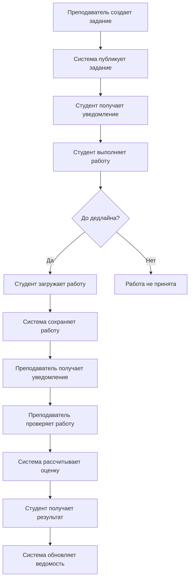

# Системный анализ
## Система оценивания учебных работ "EduGrader"

**Версия документа:** 1.0  
**Дата создания:** 21.01.2026  
**Автор:** Ларетина Дарья Алексеевна, группа 21ИС-24  
**Статус:** Учебный проект (проектирование)
**Руководитель практики:** Бобошко Михаил Николаевич

---

## Содержание
1. [Введение](#1-введение)
2. [Анализ текущей ситуации](#2-анализ-текущей-ситуации)
3. [Анализ требований](#3-анализ-требований)
4. [Анализ предметной области](#4-анализ-предметной-области)
5. [Анализ аналогичных решений](#5-анализ-аналогичных-решений)
6. [Определение границ системы](#6-определение-границ-системы)
7. [Анализ рисков](#7-анализ-рисков)
8. [Выводы и рекомендации](#8-выводы-и-рекомендации)

---

## 1. Введение

### 1.1. Цель документа
Целью настоящего документа является проведение системного анализа для разработки системы автоматизации оценивания учебных работ "EduGrader". Документ описывает существующие проблемы, требования заинтересованных сторон и определяет функциональные границы системы.

### 1.2. Объект анализа
Объектом анализа является процесс оценивания учебных работ в образовательных учреждениях, включающий:
- Создание и публикацию заданий
- Сдачу работ студентами
- Проверку и оценку работ преподавателями
- Формирование отчетности и аналитики

### 1.3. Методология анализа
Для проведения анализа использовались следующие методы:
- Изучение нормативных документов образовательного процесса
- Анализ существующих систем оценивания
- Опрос потенциальных пользователей (студентов и преподавателей)
- Моделирование бизнес-процессов
- Сравнительный анализ аналогичных решений

---

## 2. Анализ текущей ситуации (AS-IS)

### 2.1. Существующий процесс оценивания
В настоящее время процесс оценивания учебных работ в большинстве образовательных учреждений осуществляется по следующей схеме:

```
1. Преподаватель создает задание
   ↓
2. Задание публикуется (через email, LMS или на бумаге)
   ↓
3. Студент выполняет работу
   ↓
4. Студент сдает работу (физически или по email)
   ↓
5. Преподаватель собирает все работы
   ↓
6. Преподаватель проверяет каждую работу вручную
   ↓
7. Преподаватель выставляет оценки в журнал
   ↓
8. Студент получает обратную связь (часто с задержкой)
```

### 2.2. Проблемы текущего процесса

#### 2.2.1. Организационные проблемы
1. **Разрозненность данных:**
   - Работы хранятся в разных местах (email, флеш-накопители, бумажные носители)
   - Отсутствие централизованного архива работ
   - Сложность поиска и анализа исторических данных

2. **Низкая скорость процессов:**
   - Ручной сбор и распределение работ
   - Отсутствие автоматических уведомлений
   - Длительные сроки проверки

3. **Ошибки и неточности:**
   - Человеческий фактор при переносе оценок
   - Потеря работ или оценок
   - Несвоевременное информирование студентов

#### 2.2.2. Педагогические проблемы
1. **Неоднородность оценивания:**
   - Субъективность оценки
   - Отсутствие единых критериев
   - Разные подходы разных преподавателей

2. **Ограниченная обратная связь:**
   - Минимальные комментарии к работам
   - Отсутствие системы для диалога
   - Невозможность оперативной доработки работ

3. **Слабая аналитика:**
   - Отсутствие статистики по успеваемости
   - Невозможность анализа типичных ошибок
   - Сложность выявления проблемных тем

#### 2.2.3. Технические проблемы
1. **Неудобство для пользователей:**
   - Необходимость использовать несколько систем
   - Сложные процессы загрузки работ
   - Отсутствие мобильной доступности

2. **Безопасность данных:**
   - Риск потери работ при передаче
   - Отсутствие резервного копирования
   - Небезопасные каналы передачи данных

### 2.3. Количественные показатели текущего процесса
На основе опроса преподавателей были получены следующие данные:

| Показатель | Текущее значение | Проблема |
|------------|------------------|----------|
| Среднее время проверки одной работы | 15-30 минут | Длительный процесс |
| Процент потери работ | 3-5% | Потери при передаче |
| Время на администрирование процесса | 20% рабочего времени | Неэффективное использование ресурсов |
| Задержка в получении обратной связи | 3-7 дней | Снижение эффективности обучения |
| Количество используемых инструментов | 3-5 различных систем | Сложность для пользователей |

---

## 3. Анализ требований

### 3.1. Заинтересованные стороны (Stakeholders)

#### 3.1.1. Первичные пользователи
1. **Студенты:**
   - Загружают выполненные работы
   - Получают оценки и обратную связь
   - Отслеживают успеваемость
   - **Основная потребность:** Прозрачность и своевременность оценивания

2. **Преподаватели:**
   - Создают задания и критерии оценки
   - Проверяют и оценивают работы
   - Анализируют успеваемость
   - **Основная потребность:** Экономия времени и стандартизация процесса

3. **Администраторы системы:**
   - Управляют пользователями
   - Настраивают систему
   - Мониторят работу системы
   - **Основная потребность:** Надежность и управляемость системы

#### 3.1.2. Вторичные пользователи
1. **Руководство учебного заведения:**
   - Мониторинг качества образования
   - Анализ эффективности преподавателей
   - Формирование отчетности

2. **Методисты:**
   - Анализ качества заданий
   - Корректировка учебных программ
   - Разработка критериев оценки

3. **Родители студентов (в перспективе):**
   - Контроль успеваемости
   - Получение отчетов

### 3.2. Функциональные требования

#### 3.2.1. Высокоуровневые требования
1. **Централизация данных:**
   - Единое хранилище всех работ и оценок
   - Структурированное хранение по курсам и группам
   - Быстрый доступ к историческим данным

2. **Стандартизация процесса:**
   - Единые шаблоны заданий
   - Система критериев оценки (рубрики)
   - Автоматический расчет оценок

3. **Автоматизация рутинных операций:**
   - Автоматические уведомления
   - Генерация отчетов
   - Контроль сроков

4. **Аналитика и отчетность:**
   - Статистика успеваемости
   - Анализ качества заданий
   - Выявление проблемных зон

#### 3.2.2. Детальные требования по модулям

**Модуль управления пользователями:**
- Разграничение прав доступа по ролям
- Профили пользователей с академической информацией
- История активности пользователей

**Модуль курсов и заданий:**
- Иерархическая структура: учебное заведение → курсы → группы → задания
- Гибкая настройка критериев оценки
- Поддержка различных типов заданий

**Модуль сдачи работ:**
- Поддержка различных форматов файлов
- Контроль сроков сдачи
- Возможность повторной сдачи

**Модуль проверки работ:**
- Удобный интерфейс для оценивания
- Система комментариев и аннотаций
- Автоматический расчет итоговых баллов

**Модуль аналитики:**
- Ведомости успеваемости
- Статистические отчеты
- Экспорт данных

### 3.3. Нефункциональные требования

#### 3.3.1. Требования к производительности
| Показатель | Требуемое значение | Обоснование |
|------------|-------------------|-------------|
| Время отклика системы | < 3 секунд | Комфортная работа пользователей |
| Количество одновременных пользователей | до 1000 | Для среднего учебного заведения |
| Время загрузки файлов | зависит от размера, с прогрессом | Удобство для студентов |
| Время генерации отчетов | < 30 секунд | Оперативное получение данных |

#### 3.3.2. Требования к надежности
- Доступность системы: 99% в рабочее время
- Время восстановления после сбоя: не более 4 часов
- Резервное копирование данных: ежедневно
- Сохранность данных: гарантия отсутствия потерь

#### 3.3.3. Требования к безопасности
- Аутентификация пользователей
- Шифрование передаваемых данных
- Разграничение прав доступа
- Защита от распространенных атак (XSS, SQL-инъекции)
- Аудит действий пользователей

#### 3.3.4. Требования к удобству использования
- Интуитивно понятный интерфейс
- Адаптивный дизайн для разных устройств
- Минимальное обучение для начала работы
- Полная документация и справка

---

## 4. Анализ предметной области

### 4.1. Образовательный процесс

#### 4.1.1. Учебные циклы
```
Академический год
    ├── Семестр 1 (осенний)
    │    ├── Модуль 1
    │    ├── Модуль 2
    │    └── Сессия
    └── Семестр 2 (весенний)
         ├── Модуль 3
         ├── Модуль 4
         └── Сессия
```

#### 4.1.2. Типы учебных работ
1. **Лабораторные работы:**
   - Практические задания
   - Отчеты по экспериментам
   - Критерии: правильность выполнения, оформление отчета

2. **Курсовые проекты:**
   - Длительные проекты
   - Этапная сдача
   - Критерии: оригинальность, глубина проработки, практическая ценность

3. **Тестовые работы:**
   - Проверка знаний
   - Автоматическая проверка
   - Критерии: правильность ответов

4. **Эссе и рефераты:**
   - Аналитические работы
   - Текстовые форматы
   - Критерии: логичность изложения, аргументация, оформление

#### 4.1.3. Системы оценивания
1. **Балльная система:**
   - Максимальный балл за задание
   - Вес задания в итоговой оценке
   - Перевод в 5-балльную шкалу

2. **Критериальное оценивание (рубрики):**
   - Детализированные критерии
   - Уровни выполнения
   - Объективность оценки

3. **Рейтинговая система:**
   - Накопление баллов в течение семестра
   - Рейтинг в группе/потоке
   - Автоматический расчет итоговой оценки

### 4.2. Нормативная база

#### 4.2.1. Требования к оцениванию
1. **Объективность:**
   - Единые критерии для всех студентов
   - Прозрачность процесса
   - Возможность апелляции

2. **Своевременность:**
   - Установленные сроки проверки
   - Оперативная обратная связь
   - Своевременное информирование

3. **Документирование:**
   - Фиксация всех оценок
   - Хранение работ
   - Формирование ведомостей

#### 4.2.2. Требования к хранению данных
- Срок хранения работ: не менее 5 лет
- Конфиденциальность персональных данных
- Резервное копирование
- Целостность данных

### 4.3. Бизнес-процессы

#### 4.3.1. Основной процесс оценивания


#### 4.3.2. Процесс формирования итоговой оценки
```
Для каждого студента:
    1. Получить все оценки по курсу
    2. Применить веса заданий
    3. Рассчитать средневзвешенный балл
    4. Перевести в 5-балльную шкалу (если требуется)
    5. Зафиксировать итоговую оценку
    6. Сформировать ведомость
```

---

## 5. Анализ аналогичных решений

### 5.1. Существующие системы

#### 5.1.1. Системы управления обучением (LMS)
1. **Moodle:**
   - **Преимущества:** Открытый исходный код, множество плагинов
   - **Недостатки:** Сложность настройки, громоздкий интерфейс
   - **Функциональность оценивания:** Базовая, требует доработок

2. **Google Classroom:**
   - **Преимущества:** Простота использования, интеграция с Google Документами
   - **Недостатки:** Ограниченная функциональность, зависимость от Google
   - **Функциональность оценивания:** Упрощенная, без детальных критериев

3. **Blackboard:**
   - **Преимущества:** Мощная функциональность, хорошая аналитика
   - **Недостатки:** Высокая стоимость, сложность освоения
   - **Функциональность оценивания:** Полнофункциональная, но сложная

#### 5.1.2. Специализированные системы оценивания
1. **Turnitin:**
   - **Назначение:** Проверка на плагиат
   - **Оценивание:** Базовая функциональность
   - **Целевая аудитория:** Преподаватели вузов

2. **Gradescope:**
   - **Назначение:** Оценивание работ с рукописными ответами
   - **Оценивание:** Продвинутая система рубрик
   - **Целевая аудитория:** Преподаватели STEM-дисциплин

### 5.2. Сравнительный анализ

| Критерий | EduGrader | Moodle | Google Classroom | Gradescope |
|----------|-----------|---------|------------------|-------------|
| Специализация на оценивании | Высокая | Средняя | Низкая | Высокая |
| Гибкость критериев оценки | Высокая | Средняя | Низкая | Высокая |
| Простота использования | Высокая | Низкая | Высокая | Средняя |
| Стоимость | Бесплатно (учебный проект) | Бесплатно (Open Source) | Бесплатно | Платная |
| Кастомизация | Высокая | Высокая | Низкая | Средняя |
| Интеграционные возможности | Средние | Высокие | Высокие | Средние |
| Аналитика и отчетность | Высокая | Высокая | Низкая | Высокая |

### 5.3. Рыночная ниша
Система "EduGrader" занимает следующую нишу:
- **Целевая аудитория:** Средние и небольшие учебные заведения
- **Основное преимущество:** Специализация на процессе оценивания
- **Уникальные особенности:** Гибкая система критериев, удобный интерфейс проверки
- **Ценовое позиционирование:** Бесплатное решение для учебных заведений

---

## 6. Определение границ системы

### 6.1. Что включает система (In Scope)

#### 6.1.1. Функциональные границы
1. **Управление учебным процессом:**
   - Создание и управление курсами
   - Формирование учебных групп
   - Назначение преподавателей

2. **Управление заданиями:**
   - Создание заданий с критериями
   - Установка сроков сдачи
   - Публикация заданий

3. **Сдача и проверка работ:**
   - Загрузка студенческих работ
   - Интерфейс для оценивания
   - Система комментариев и обратной связи

4. **Управление оценками:**
   - Расчет итоговых оценок
   - Формирование ведомостей
   - Экспорт оценок

5. **Аналитика и отчетность:**
   - Статистика успеваемости
   - Анализ качества заданий
   - Генерация отчетов

6. **Системные функции:**
   - Управление пользователями
   - Настройка системы
   - Резервное копирование

#### 6.1.2. Технические границы
- Веб-приложение с клиент-серверной архитектурой
- Поддержка современных браузеров
- Хранение файлов работ на сервере
- REST API для интеграций

### 6.2. Что не включает система (Out of Scope)

#### 6.2.1. Функциональные ограничения
1. **Обучающие материалы:**
   - Хранение и управление учебными материалами
   - Проведение онлайн-курсов
   - Тестирование знаний

2. **Коммуникационные функции:**
   - Форумы и дискуссии
   - Видеоконференции
   - Чат в реальном времени

3. **Административные функции:**
   - Управление расписанием занятий
   - Формирование учебных планов
   - Учет посещаемости

4. **Дополнительные сервисы:**
   - Библиотека учебных материалов
   - Система портфолио студентов
   - Карьерный центр

#### 6.2.2. Технические ограничения
- Мобильные приложения (только адаптивный веб-интерфейс)
- Офлайн-режим работы
- Интеграция с внешними системами (в первой версии)
- Поддержка устаревших браузеров

### 6.3. Границы данных
```
Включается:
├── Данные пользователей (учетные записи, роли)
├── Учебные курсы и группы
├── Задания и критерии оценки
├── Сданные работы студентов
├── Оценки и комментарии
├── Статистика и отчеты
└── Системные настройки

Исключается:
├── Персональные данные (паспортные данные, медицинские справки)
├── Финансовая информация
├── Конфиденциальная переписка
└── Материалы, защищенные авторским правом
```

---

## 7. Анализ рисков

### 7.1. Технические риски

#### 7.1.1. Риски разработки
| Риск | Вероятность | Влияние | Меры минимизации |
|------|-------------|---------|------------------|
| Недостаток опыта в разработке | Высокая | Среднее | Консультации с руководителем, изучение документации |
| Сложности с интеграцией компонентов | Средняя | Высокое | Модульная архитектура, поэтапная разработка |
| Проблемы с производительностью | Низкая | Высокое | Тестирование на ранних этапах, оптимизация запросов |
| Ошибки в алгоритмах расчета оценок | Средняя | Высокое | Тщательное тестирование, проверка расчетов |

#### 7.1.2. Риски эксплуатации
| Риск | Вероятность | Влияние | Меры минимизации |
|------|-------------|---------|------------------|
| Потеря данных | Низкая | Критическое | Регулярное резервное копирование, мониторинг |
| Недостаточная производительность | Средняя | Высокое | Мониторинг нагрузки, оптимизация БД |
| Проблемы с безопасностью | Средняя | Критическое | Регулярные обновления, аудит безопасности |
| Сложность обновления | Низкая | Среднее | Модульная архитектура, автоматизация деплоя |

### 7.2. Организационные риски

#### 7.2.1. Риски внедрения
| Риск | Вероятность | Влияние | Меры минимизации |
|------|-------------|---------|------------------|
| Сопротивление пользователей | Высокая | Высокое | Обучение пользователей, упрощение интерфейса |
| Несоответствие реальным процессам | Средняя | Высокое | Учет мнения пользователей при разработке |
| Недостаточное обучение | Средняя | Среднее | Создание подробной документации, видеоуроков |
| Отсутствие технической поддержки | Низкая | Высокое | Создание базы знаний, FAQ |

#### 7.2.2. Риски использования
| Риск | Вероятность | Влияние | Меры минимизации |
|------|-------------|---------|------------------|
| Неправильное использование системы | Высокая | Среднее | Четкая документация, подсказки в интерфейсе |
| Нарушение политики оценивания | Средняя | Высокое | Валидация входных данных, логирование действий |
| Потеря мотивации пользователей | Низкая | Среднее | Регулярные улучшения, учет обратной связи |
| Проблемы с масштабированием | Низкая | Высокое | Архитектура, позволяющая масштабирование |

### 7.3. Педагогические риски

#### 7.3.1. Риски для образовательного процесса
| Риск | Вероятность | Влияние | Меры минимизации |
|------|-------------|---------|------------------|
| Формализация оценивания | Средняя | Среднее | Гибкая система критериев, возможность кастомизации |
| Снижение качества обратной связи | Низкая | Высокое | Удобные инструменты для комментариев |
| Необъективность автоматической оценки | Высокая | Высокое | Система как помощник, а не замена преподавателя |
| Нарушение академической честности | Средняя | Высокая | Инструменты проверки оригинальности |

### 7.4. Матрица рисков
```
Высокая
  │            Риск 1         Риск 3
  │
В │                          Риск 2
л │
и │
я │        Риск 4
н │
и │                    Риск 5
е │
  │
Низкая      Низкая      Средняя     Высокая
            Вероятность
```

**Ключевые риски, требующие внимания:**
1. **Риск 1:** Сопротивление пользователей (вероятность: высокая, влияние: высокое)
2. **Риск 2:** Ошибки в алгоритмах расчета (вероятность: средняя, влияние: высокое)
3. **Риск 3:** Проблемы с безопасностью (вероятность: средняя, влияние: критическое)

---

## 8. Выводы и рекомендации

### 8.1. Основные выводы

#### 8.1.1. Проблемы текущего процесса
1. **Существенные недостатки:** Процесс оценивания характеризуется низкой эффективностью, субъективностью и высокой трудоемкостью.
2. **Техническая отсталость:** Отсутствие специализированных инструментов приводит к использованию не предназначенных для этого систем.
3. **Организационные сложности:** Разрозненность данных и процессов усложняет управление учебным процессом.

#### 8.1.2. Потребности пользователей
1. **Студенты:** Нуждаются в прозрачной и своевременной системе оценивания с качественной обратной связью.
2. **Преподаватели:** Требуют инструментов для стандартизации процесса и экономии времени.
3. **Администрация:** Необходима система для централизованного управления и аналитики.

#### 8.1.3. Рыночные возможности
1. **Свободная ниша:** Отсутствие специализированных решений для российских учебных заведений.
2. **Технологическая готовность:** Современные технологии позволяют создать эффективное решение.
3. **Экономическая целесообразность:** Автоматизация позволит значительно сократить затраты времени и ресурсов.

### 8.2. Рекомендации по разработке

#### 8.2.1. Стратегические рекомендации
1. **Фокус на специализации:** Создание системы, специализирующейся именно на оценивании работ, а не полной LMS.
2. **Поэтапная разработка:** Реализация функциональности по приоритету, начиная с основных модулей.
3. **Гибкость системы:** Возможность адаптации под разные учебные заведения и дисциплины.
4. **Простота использования:** Интуитивный интерфейс, не требующий длительного обучения.

#### 8.2.2. Тактические рекомендации
1. **Приоритетные модули для первой версии:**
   - Управление пользователями и ролями
   - Создание и публикация заданий
   - Загрузка и проверка работ
   - Базовая система отчетности

2. **Технологические решения:**
   - Веб-приложение с адаптивным дизайном
   - Современный стек технологий (Python/FastAPI, React, PostgreSQL)
   - Открытые стандарты и протоколы
   - Модульная архитектура для будущего расширения

3. **Подход к тестированию:**
   - Раннее привлечение реальных пользователей
   - Фокус на usability-тестировании
   - Тестирование на разных устройствах и браузерах

#### 8.2.3. Рекомендации по внедрению
1. **Пилотный проект:** Начальное внедрение в одном учебном курсе или группе.
2. **Обучение пользователей:** Создание обучающих материалов и проведение тренингов.
3. **Обратная связь:** Регулярный сбор и учет мнения пользователей.
4. **Постоянное улучшение:** Итеративная разработка с учетом опыта использования.

### 8.3. Ожидаемые результаты

#### 8.3.1. Количественные результаты
| Показатель | Текущее значение | Ожидаемое значение | Улучшение |
|------------|------------------|-------------------|----------|
| Время проверки работы | 15-30 минут | 5-10 минут | 50-70% |
| Срок получения обратной связи | 3-7 дней | 1-3 дня | 50-70% |
| Количество потерянных работ | 3-5% | < 1% | 80-90% |
| Время на администрирование | 20% | 5% | 75% |

#### 8.3.2. Качественные результаты
1. **Повышение объективности оценивания:** Единые критерии и прозрачный процесс.
2. **Улучшение качества обратной связи:** Детальные комментарии и возможность диалога.
3. **Упрощение управления процессом:** Централизованное хранение данных и автоматизация.
4. **Повышение удовлетворенности пользователей:** Удобный интерфейс и экономия времени.

### 8.4. Заключение

Проведенный системный анализ показал **высокую необходимость** и **техническую возможность** создания системы автоматизации оценивания учебных работ "EduGrader". 

**Ключевые преимущества** разрабатываемой системы:
1. **Специализация:** Фокус именно на процессе оценивания
2. **Гибкость:** Возможность адаптации под разные дисциплины и форматы работ
3. **Простота:** Интуитивный интерфейс, не требующий длительного обучения
4. **Эффективность:** Значительное сокращение времени на рутинные операции

Рекомендуется приступить к разработке системы с учетом выявленных требований и рекомендаций. Особое внимание следует уделить **вовлечению конечных пользователей** в процесс разработки и тестирования для обеспечения соответствия системы реальным потребностям.

---

## Приложение 1: Глоссарий терминов

**Рубрика (Rubric)** - Система критериев оценки с описанием уровней выполнения  
**Критерий оценки** - Конкретный параметр, по которому оценивается работа  
**Дедлайн (Deadline)** - Крайний срок выполнения задания  
**Вес задания** - Коэффициент, определяющий важность задания в итоговой оценке  
**Средневзвешенный балл** - Средний балл с учетом весов заданий  
**Ведомость** - Официальный документ с оценками студентов  
**Peer Review** - Взаимная проверка работ студентами  
**Плагиат** - Использование чужой работы без указания авторства  

## Приложение 2: Список нормативных документов

1. Федеральный закон "Об образовании в Российской Федерации"
2. Федеральные государственные образовательные стандарты (ФГОС)
3. Локальные нормативные акты образовательных учреждений
4. Положение о проведении промежуточной аттестации
5. Положение о системе оценивания учебных достижений

---

**Разработал:**  
___________________________  
**Ларетина Дарья Алексеевна**  
Студент группы 21ИС-24  
Дата: 21.01.2026

**Принял:**  
___________________________  
**Бобошко Михаил Николаевич**  
Руководитель учебной практики  
Дата: ___________________

---
